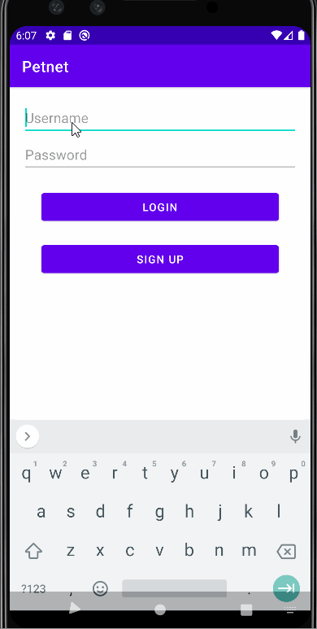

# Paw
## Table of Contents
1. [Overview](#Overview)
1. [Product Spec](#Product-Spec)
1. [Wireframes](#Wireframes)
2. [Schema](#Schema)

## Overview
### Description
This app is dedicated to showcase your pets, connect you to pets up for adoption, and also for petsitters who are setting their pet up for a dedicated pet sitting job or taking care of your pet.

### App Evaluation
[Evaluation of your app across the following attributes]
- **Category:** Social Networking and Lifestyle?
- **Mobile:** This is essential to be mobile because this app would be dedicated to showing off your pets. Basically seeing anyone in the area interested in pets, it would be showcased here. 
- **Story:** Creates a more mobile access to showcasing pets in specific, compared to bigger social networks that focus on general picture socializing.
- **Market:** Can be used by different organizations, whether it would be a Zoo, an Animal Shelter, Individuals with multiple pets or animals, animal lovers, etc.
- **Habit:** Can be used daily, or weekly to see different pet postings, new events, new showcases, gatherings, etc. Would also be used to check up on different animals by having indirect contact to them.
- **Scope:** Connects people to pets and to other pet owners. We can first start by adding people

## Product Spec

### 1. User Stories (Required and Optional)

**Required Must-have Stories**

* User can register for a new account
* User can login
* User can upload pictures of their pets
* User can connect with other pet owners

**Optional Nice-to-have Stories**

* User can find a pet for adoption at a nearby animal shelter
* User can find a petsitter easily

### 2. Screen Archetypes

* Login
    * User can login when the app opens
* Register - User signs up or logs into their account
   * User is prompted to register or log into an existing account upon first opening the application
* Pet Feed
   * User is shown content of pets based on their preferences
   * User is able to filter what kinds of content they want/don't want to see on their feed
* Petsitter
    * User is able to find a petsitter and communicate with them
* Pet Adoption
   * User is able to view adoption centers at animal shelters nearby
* User Profile
   * User is able to edit preferences such as what pets they are interested in and if they are an owner or not
   * User is able to change profile picture as well as name
   * Pet Profile - a sub profile for a User Profile that shows the users' pet(s)

### 3. Navigation

**Tab Navigation** (Tab to Screen)

* Pet Feed
* Pet Adoption
* User Profile
    * Pet Profiles

**Flow Navigation** (Screen to Screen)
* Login
    * Pet Feed
* Register
    * Pet Feed
* Pet Feed
    * User Profiles
* Petsitter
    * petsitter profile // tbdfigma
* Pet Adoption
    * Shelters Page
* User Profile
    * Pet Feed 

## Wireframes

### [BONUS] Digital Wireframes & Mockups

### [BONUS] Interactive Prototype

## Schema 
### Models

   | Property      | Type     | Description |
   | ------------- | -------- | ------------|
   | objectId      | String   | unique id for the user post (default field) |
   | author        | Pointer to User| image author |
   | image         | File     | image that user posts |
   | caption       | String   | image caption by author |
   | likesCount    | Number   | number of likes for the post |

### Networking
- Home Feed Screen
   - (Read/GET) Query all posts where user is author
   - (Create/POST) Create a new like on a post
   - (Delete) Delete existing like
   - (Create/POST) Create a new comment on a post
   - (Delete) Delete existing comment
- Create Post Screen
   - (Create/POST) Create a new post object
- Profile Screen
   - (Read/GET) Query logged in user object
   - (Update/PUT) Update user profile image

- [Add list of network requests by screen ]
- [Create basic snippets for each Parse network request]
- [OPTIONAL: List endpoints if using existing API such as Yelp]

## User stories
- [X]  Main Login Screen
   - [X]  Connect to Back4App
   - [X]  Create Test Profiles
   - [X]  Login Button -> Main Screen
   - [X]  Register Button -> Requried to Input Username and Password -> First Time Profile Set up Screen
- [X]  Main Screen
   - [X]  Main Profile Screen Shows up
   - [X]  Functionality of Check and X buttons
   - [X]  Being able to swipe left for no, right for yes.
- [ ]  Matches/Messaging Screen
   - [ ]  Recycler View of People you have been messaging with
- [X]  Profile Options Menu Screen
   - [X]  User Profile Settings Button -> User Profile Screen
   - [X]  Pet Profile Settings Button -> Pet Profile Screen
   - [X]  Previewing Profile picture, as well as pet picture
- [X]  First time Profile Set up screen
   - [X]  Requiring For at least for:
      - [X]  User: Must have name, 1 picture, looking for, who are you tag.
      - [X]  *Pet is optional but to create a pet profile must have: * 1 picture, looking for.
- [X]  User Profile (Make sure this allows you to edit the user data)
   - [X]  1 Picture able to upload and change. Tap to edit or change the picture.
   - [X]  Description box.
- [X]  Pet Profile (Make sure this allows you to edit the user data)
   - [X]  1 Picture able to upload and change. Tap to edit or change the picture.
   - [X]  Description box
- [X]  ToolBar and Fragments
   - [X]  Base UI of 3 Fragment Screens (Main, Matches, Profile)
   - [X]  Bottom toolbar to switch between fragments

Stretch Goals
 - [ ] Main Screen
   - [ ]  *Stretch* Tapping the Profile will be able to preview the whole profile layout
   - [ ]  *Stretch* No more Matches left screen
- [ ]  Matches/Messaging Screen
   - [ ]  *Stretch* Functionality of Filters Buttons
   - [ ]  *Stretch* Previewing new matches
- [ ]  Profile Options Menu Screen
   - [ ]  *Stretch *Toggle Button Functionality for Fitlering Search Criteria
   - [ ]  *Stretch* Being able to manually search for organizations and people for adopting pets
- [ ]  User Profile
   - [ ]  *Stretch* Maximum 4 pics
   - [ ]  *Stretch* Description box. Max: 280 chars
   - [ ]  *Stretch* Looking for tag box. tags: Petsitter/Dogwalker, Adopting pets, Other Petowners
   - [ ]  *Stretch* Who are you tag box. tags: Human, Organization/Adoption Center, Other... 
- [ ]  Pet Profile 
   - [ ]  *Stretch* Maximum 4 pics
   - [ ]  *Stretch* Description box. Max: 280 chars
   - [ ]  *Stretch* Who are you tag box. tags: Dog, Cat, Bird, Other...
- [ ]  First time Profile Set up screen
   - [ ]  *Stretch* Button being able to add more pet profiles

## Build Progress
11/13-11/19 Progress

GIF created with [LiceCap](http://www.cockos.com/licecap/).

*Input Brief Description of what was added*

This week we worked on setting up the project on github and implementing the required stories for our app. Here
is a list of what was implemented:
- Login screen
   - sign in to the app
   - sign up for an profile
- Fragments
   - Home: with check and remove button
   - settings: The UI for the settings fragment
   - messages: The UI for the messaging screen
- Logout Button
   . In the home fragment for now but will be changed to different location when other features have been implemented

11/20-11/26

This Week's work:
- Login Screen
  - Working registration and required fields to create a profile
- Main Screen
  - Swipe Cards functionality and base UI of the cards
- Settings Screen
  - Edit user profile and Edit Pet Profile functionalities (currently not fully functional)
- Messages Screen
  - Base Code for appearance of new matches (not currently shown, requires the implementation of matching users data)
- ETC
  - Moved the logout button to the settings screen

11/27 - 12/3

<

This Week's work:
- Login Screen
  - Improvements to current log in system.
  - Now Requires a 6 letter password and an email (currently using fake emails for the moment)
  - Will recognize incorrect inputs properly
- Main Screen
  - Buttons now do work to assist with matching.
- Settings Screen
  - Settings now do translate propery from the database into its appropriate boxes, allowing for more accurate saving and checking for all information
- Messages Screen
  - Now able to recognize matching and will now show up in the matches list in the messages screen.
- ETC
  - Now also able to add your own pets into the list of pets available to swipe for
  - More Updates to current UI

12/3 - 12/11
<

This Week's work:
- Improvements to UI (color changes, object placement changes, theme changes, etc.)
- Messages was properly implemented (including Time, username, and text into Recycler view)
- Adding more test users
- Renamed the file from PetNet to PAW

*Input Brief Description of what was added*
